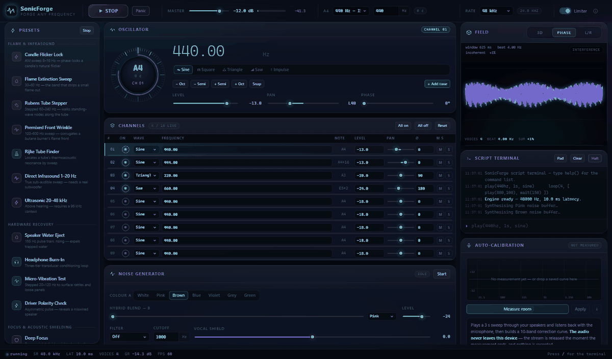
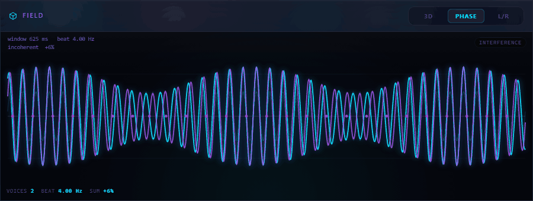
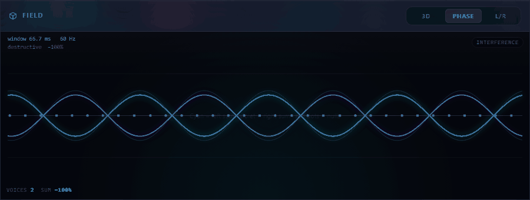

<div align="center">


<br>

**A 16-channel precision tone generator, seven-colour noise lab, microphone room
calibration and a real-time 3D spectrogram — running entirely in your browser.**

**[▶ Open SonicForge](https://samtherocket.github.io/sonicforge/)**

`No install` · `No account` · `Nothing uploaded` · `Works offline`

<br>



</div>

---

## Why this exists

This came out of a combustion-acoustics experiment.

We had designed the study, built the apparatus, and stood it up physically. The
acoustic sources were speakers, and the whole point was to vary parameters —
frequency, amplitude, waveform, phase, spectral content — and observe what each
one did to a flame front. For that to mean anything, the excitation had to be
*controlled*: known, repeatable, and comparable between runs.

The tooling was the problem. Every generator we tried had its own conventions.
One would call a level a percentage, another an arbitrary 0–100, another
something it never named. Amplitude behaved differently between them. None
offered phase at all. Switching tools mid-study meant the runs were no longer
comparable, and switching *back* meant re-deriving what a setting had actually
meant.

So this is the instrument that should have existed: one place where every
parameter is stated in a real unit, behaves the same way every time, and is
visible while it is happening. Level in dBFS, not percent. Phase in degrees,
because you cannot study interference without it. A spectrogram and an
interference field so you can watch the parameter you changed act on the signal,
rather than inferring it afterwards.

Our case was **diffusion and premixed flame fronts**. It is not limited to
that. Acoustic parameters act on plenty of systems, and a tool that makes
"which parameter, how much, and what did it do" legible is useful wherever that
question is being asked.

> **On physiological effects.** Part of what motivated this work is the broader
> question of how specific frequencies affect the body. SonicForge is a precise
> instrument for *conducting* that kind of investigation — it will reproduce a
> stimulus exactly and show you what it is doing. It makes no claim that any
> frequency produces any particular hormonal or neurochemical effect. That is a
> question to be tested, and this is a tool for testing it.

---

## What it does

<table>
<tr><td width="50%" valign="top">

### 16 independent channels
Each with its own waveform, dBFS level, stereo position, **starting phase**,
detune and glide. Run all sixteen at once.

### Real phase control
`OscillatorNode` has no phase parameter — you genuinely cannot start two
oscillators at a chosen offset. SonicForge builds each wave from its Fourier
coefficients and rotates every harmonic, so phase is baked into the wave table.
Two channels 180° apart cancel to **exact silence**, and the test suite asserts
the residual is `0.00e+0`.

### Seven noise colours
White, pink (Voss–McCartney), brown (Brownian integration), blue, violet, grey
(inverse equal-loudness) and green. Any two cross-blend on an equal-power curve.

</td><td width="50%" valign="top">

### Room auto-calibration
Plays a 3-second sweep, listens with your microphone, and builds a 10-band
correction curve. It measures the round-trip latency **first** — without that,
the measurement lands on the wrong frequencies entirely.

### Scriptable
A small unit-aware language, run on the audio clock with lookahead scheduling,
so it never drifts and never blocks the interface:

```
loop(4, [ play(440hz, 200ms), wait(100ms) ])
am(200hz, 11hz, 30s, 100%, -8db)
sweep(20hz, 20khz, 3s, exponential)
```

### Concert Mode
Sync several devices with NTP-style clock alignment and a per-device phase
offset, for real spatial-cancellation experiments.

</td></tr>
</table>

Frequency range is **0.05 Hz to just under Nyquist** — 24 kHz at the default
sample rate, **48 kHz** if you switch the context to 96 kHz.

---

## Seeing the signal

<div align="center">

</div>

Above: 60 Hz against 64 Hz. The **cyan** trace is the left channel sum, the
**violet** trace the right, and the red dots mark where the superposition
collapses. The readout names the beat — `4.00 Hz` — because it derives it from
the channel parameters rather than guessing from an analyser. The carriers are
low here only so that individual cycles stay legible at this size; 440 Hz
against 444 Hz gives the same 4 Hz beat.

This matters more than it looks. An FFT can tell you the result is quiet. It
cannot tell you *why*. The interference view computes the superposition
analytically from each channel's own frequency, phase, level and pan, so you can
watch two tones annihilate while their individual contributions keep swinging at
full amplitude underneath.

### Phase is a control, not a label

<div align="center">

</div>

Two 60 Hz sines, identical but for phase, with one swept from 0° to 180° and
back. The verdict tracks the sum the whole way: `constructive +41%` where they
reinforce, `destructive −100%` at the null. The pale traces underneath are the
individual channels, still at full amplitude while their sum disappears.

That sweep is not available in a browser by default. `OscillatorNode` has no
phase parameter, so SonicForge builds each waveform from its Fourier
coefficients and rotates every harmonic, baking the offset into the wave table.

---

## Run it locally

No build step, no dependencies. You only need a static server, because ES
modules cannot load from `file://`.

```bash
git clone https://github.com/SAMtheROCKET/sonicforge.git
cd sonicforge
python server/serve.py
```

```
  local     http://localhost:8080/
  network   http://192.168.1.20:8080/     <- open this on your phone
  tests     http://localhost:8080/tests.html
  relay     ws://192.168.1.20:8787        <- Concert Mode / LAN
```

Any static server works. The bundled `server/serve.py` is pure standard library
and additionally runs the optional WebSocket relay for Concert Mode's LAN tier.

---

## Deploy

The whole application is static.

**GitHub Pages** — push to `main` and set **Settings → Pages → Source** to
**Deploy from a branch** (`main`, `/`). An optional CI workflow that verifies
the build first lives in `ci/`; see `ci/README.md`.

**Vercel** — `npx vercel deploy --prod`. `vercel.json` sets the correct
`text/javascript` MIME type for ES modules, a `no-cache` policy on `sw.js`, and
a `Permissions-Policy` allowing the microphone and denying everything else.

Every asset path is relative, so it works at `/repo-name/` or a domain root
without changes. After changing any shipped file:

```bash
python tools/build_precache.py
```

The service worker precaches all 54 shipped files (~632 KB) so the app runs with
no connection. It is deliberately **not** registered on `localhost`, or a
cache-first worker would serve your previous edit back on every reload.

---

## Privacy

There is no backend. There is nothing to have a backend *for*.

- **Nothing is uploaded, ever.** No analytics, no telemetry, no CDN.
- **The microphone** opens only while a calibration measurement runs, and is
  released in a `finally` block — so it is let go even if the measurement fails
  or you cancel it. No audio is recorded or stored; only a 96-point magnitude
  curve leaves the analyser, and it stays in your browser.
- **Your session** is kept in `localStorage` on your own device.
- **Concert Mode** defaults to `BroadcastChannel`, which never leaves your
  browser. The LAN tier talks to a relay *you* run; it forwards bytes and never
  inspects, stores or logs them.

---

## Flame, infrasound and ultrasound

SonicForge will synthesise a perfect 7 Hz sine. **Your speaker will not
reproduce it.** A laptop driver rolls off below ~400 Hz; a bookshelf speaker
below ~50 Hz. If nothing moves, that is the transducer, not the signal.

The workaround is `am()`: amplitude-modulate an audible carrier at the
infrasonic rate. A 200 Hz carrier with an 11 Hz envelope delivers an **11 Hz
forcing** that a flame responds to, while the speaker only ever has to reproduce
200 Hz.

| Effect | Band | Notes |
|---|---|---|
| Candle flicker lock-in | **9–15 Hz** | A candle's buoyancy-driven flicker is already ~10–13 Hz. Drive near it and the flicker phase-locks. Use `am()`. |
| Flame extinction by sound | **30–60 Hz** | Needs a subwoofer and real SPL. |
| Rubens tube standing waves | **50–250 Hz** | λ = c/f. At 150 Hz, λ ≈ 2.3 m. |
| Premixed front wrinkling | **100–600 Hz** | Best visible band for a butane burner. |
| Rijke / thermoacoustic | **f = c/2L or c/4L** | ~170–340 Hz for a 0.5–1 m tube. |
| Ultrasound | **>20 kHz** | Needs a 96 kHz context *and* a piezo tweeter. |

> **Flames respond to acoustic velocity, not pressure.** Put the flame at a
> velocity antinode, which is a *pressure node* — in a Rubens tube that is where
> the flames are **shortest**, not tallest. Getting this backwards is the most
> common reason people report "no effect".

### Safety

- Sustained levels above ~85 dB damage hearing. The loud presets cap master
  output and require confirmation, but they cannot measure your room.
- **Take headphones off** before any speaker routine. The water-eject and
  extinction presets are genuinely unsafe in-ear.
- Never leave an open flame unattended. A Rubens tube is a pipe full of
  flammable gas — build and operate one only if you already know how.

---

## Architecture

Vanilla ES2022 modules. No framework, no bundler, no runtime dependency — the
app makes **zero network requests** once loaded, which is what makes the offline
guarantee real rather than aspirational.

```
index.html            application shell
tests.html            assertion suite (open it; it runs itself)

js/
  main.js             bootstrap and wiring
  pwa.js              service-worker registration

  util/               pure helpers, no audio knowledge
    numeric  amplitude  frequency  random  matrix4  events
    qr  qr-patterns  qr-masking  qr-error-correction

  dsp/                pure signal processing, unit-testable
    fourier           radix-2 FFT, forward and inverse
    weighting         A/C-weighting, inverse equal-loudness
    smoothing         fractional-octave smoothing, log resampling
    noise-synthesis   the generators
    noise-colours     the catalogue

  core/               the audio graph
    audio-engine      context lifecycle + master chain
    master-meter      the analyser taps
    calibration-equaliser   the ten correction bands
    gesture-unlock    autoplay-policy handling
    output-device     setSinkId routing
    tone-channel      one voice
    channel-rack      the sixteen, plus solo masking
    channel-serialisation   capture/restore (untrusted input)
    tuning            concert pitch, note maths
    waveforms         phase-rotated wave tables
    room-calibrator   measurement orchestration
    calibration-capture     microphone and stimulus
    calibration-analysis    response to correction curve

  script/             lexer -> parser -> VM -> commands
  viz/                glutil, waterfall (WebGL2), interference (2D)
  ui/                 dial, channels, terminal, panels, feedback, icons
  sync/               transport tiers, Concert Mode clock
  presets/            the intent-driven preset catalogue

tools/
  lint_style.py       enforces STYLE_GUIDE.md
  check_wiring.py     imports resolve, DOM ids exist, tokens defined
  build_precache.py   service-worker manifest
  capture_visuals.py  regenerates the screenshots and animations
```

### Three decisions worth knowing about

**No Three.js.** The 3D spectrogram is raw WebGL2 — one shader program, one
indexed mesh, one streaming texture. Pulling a scene graph from a CDN to get
that would have cost the offline guarantee.

**The QR encoder is written from ISO/IEC 18004.** Concert Mode needs a phone to
join in one gesture, and a QR library would have been a network request. It is
~1,100 lines across four modules, verified end-to-end against Chrome's
`BarcodeDetector`.

**The scripting VM runs on two clocks.** A 25 ms wall-clock tick walks the
instruction list *ahead of real time*, scheduling audio against the sample clock
up to a 350 ms lookahead. Chaining `setTimeout` calls instead would accumulate
jitter until a sixteen-step loop sounded ragged.

---

## Testing

```bash
python server/serve.py
# then open http://localhost:8080/tests.html
```

**115 assertions, no framework.** Nothing is mocked: the noise tests measure the
actual spectrum of a generated buffer, and the integration tests render real
audio through `OfflineAudioContext` and measure the samples.

```
PeriodicWave vs native sine        max sample difference  0.00e+0
180°-opposed sines                 residual peak          0.00e+0
90° phase rotation                 lag 32 samples (quarter period = 32)
pink noise slope                   -3.05 dB/octave  (nominal -3)
brown noise slope                  -5.57 dB/octave  (nominal -6)
blue noise slope                   +3.35 dB/octave  (nominal +3)
violet noise slope                 +6.30 dB/octave  (nominal +6)
Hann scalloping loss               -1.42 dB (theoretical worst case)
QR encoder                         version 5, 37x37, 50.4% dark
```

The first line matters more than it looks. The entire phase feature depends on
Web Audio evaluating a `PeriodicWave` as `Σ real·cos + imag·sin`, and a silently
inverted sign convention would be very hard to notice by ear. So it is asserted
against the browser's own oscillator.

There is also an application self-test — 69 checks that boot the real app,
exercise every module, and audit the rendered output for `NaN`, clipped panels
and stale readouts:

```
http://localhost:8080/index.html?selftest=1     # localhost only
```

Both suites run headlessly and POST their results back to the dev server, which
is how they run in CI.

---

## Keyboard

| | | | |
|---|---|---|---|
| `Space` | Play / stop everything | `1`–`9` | Toggle that channel |
| `Esc` | Panic — immediate silence | `↑` `↓` | Previous / next channel |
| `/` | Focus the script terminal | `M` `S` | Mute / solo selected |
| `V` | Cycle the visualiser | `N` | Toggle noise |

On the dial: **Shift** for fine, **Alt** for coarse, **Ctrl** to snap to
semitones. In the terminal: **Tab** completes, **↑** recalls history, **Ctrl+C**
halts.

---

## Contributing

`STYLE_GUIDE.md` is the contract, and it is machine-enforced:

```bash
python tools/lint_style.py          # whole repo
python tools/check_wiring.py        # imports and DOM references
```

One responsibility per module, `<meaning>_<dtype>` variable names, verb-first
function names, full docstrings on every export, `UPPER_SNAKE` constants after
the imports, ≤50 code lines per function, ≤79 characters per line.

Every rule is satisfied across all 76 modules and 27,000 lines;
`lint_style.py --summary` prints the count, and CI fails the build on any
violation.

### Regenerating the visuals

```bash
python server/serve.py                    # in one terminal
python tools/capture_visuals.py --all     # in another
```

Headless Chrome renders one frame per invocation under a fixed virtual
clock, so identical budgets give identical frames. That is what makes the
animations loop seamlessly and what makes a regenerated asset comparable
with the one it replaces.

One limitation is worth knowing before you try: the 3D spectrogram, the
goniometer and the stereo meters all read the live analyser, and headless
Chrome has no audio device, so every analyser bin reads zero and those
views render empty. They need a real browser and a screen recorder. The
interference field is computed analytically from each channel's own
parameters, which is why it is the one view that is correct without a
sound card.

---

## Licence

MIT — see [LICENSE](LICENSE).
